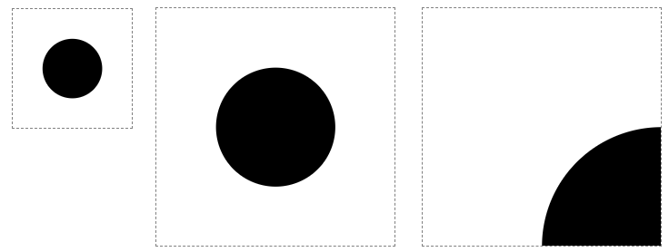
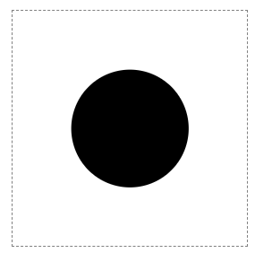
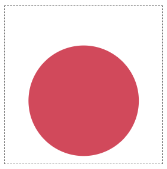
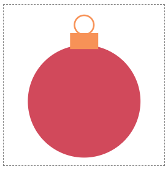

# 1. SVG를 사용하여 기본 도형 그리기

SVG(Scalable Vector Graphics)는 HTML과 유사한 구문을 갖는다. 둘 모두 XML을 기반으로 한다.

HTML5 이후로 HTML 파일 내에 SVG 이미지 코드를 인라인 할 수 있다.

```html
<html>
  <svg width="100" height="100" viewBox="0 0 100 100">
    <circle cx="50" cy="50" r="25" fill="red" />
  </svg>
</html>
```

---

## SVG 크기 조정

SVG 요소는 이미지 요소를 포함하고 이미지의 프레임을 정의한다. 즉 이미지의 내부 크기와 외부 크기를 설정한다.

- `width`와 `height`는 이미지가 브라우저에서 차지하는 공간을 정의한다.

- `viewBox`는 이미지 요소의 좌표계를 정의한다. viewBox의 처음 두 값은 이미지의 왼쪽 상단 좌표를, 마지막 두 값은 이미지 요소의 관점에서 크기를 정의한다.

- `viewBox`에 의해 정의된 크기가 `width `및 `height` 속성과 일치하지 않는 경우 이미지가 확대되거나 축소된다.



```html
<svg width="100" height="100" viewBox="0 0 200 200">
  <circle cx="100" cy="100" r="50" />
</svg>
```

```html
<svg width="200" height="200" viewBox="0 0 200 200">
  <circle cx="100" cy="100" r="50" />
</svg>
```

```html
<svg width="200" height="200" viewBox="0 0 100 100">
  <circle cx="100" cy="100" r="50" />
</svg>
```

이미지의 왼쪽 상단에 좌표를 설정할 수도 있다.

아래는 좌표계의 원점을 이미지의 중심으로 이동하고, 이미지 크기의 절반인 `-100, -100` 으로 왼쪽 상단을 설정한다.

원의 중심 위치는 `0, 0`이 된다.



```html
<svg width="200" height="200" viewBox="-100 -100 200 200">
  <circle cx="0" cy="0" r="50" />
</svg>
```

---

### 크리스마스 장식품 그리기

1. `circle`로 주요 부분을 정의한다. 원을 그리려면 중심 위치(cx, cy)와 반경(r)을 설정한다.

2. 색상을 지정한다. CSS의 `background-color`과 유사한 `fill` 속성으로 색상을 설정한다.



```html
<svg width="200" height="200" viewBox="-100 -100 200 200">
  <circle cx="0" cy="20" r="70" fill="#D1495B" />
</svg>
```

3. `rect`로 원형 장식 위에 작은 직사각형을 그린다. 직사각형의 왼쪽 상단의 위치와 크기를 설정하고 색을 입힌다.


```html
<svg
  style="border: dashed grey 1px"
  width="200"
  height="200"
  viewBox="-100 -100 200 200"
>
  <circle cx="0" cy="20" r="70" fill="#D1495B" />
  <rect x="-17.5" y="-65" width="35" height="20" fill="#F79257" />
</svg>
```

4. 사각형 위에 다른 원을 링으로 추가한다. `circle`에 `fill="none"`을 설정하고 `stroke`, `stroke-width` 속성을 사용해 테두리의 색상과 두께를 설정한다.



```html
<svg
  style="border: dashed grey 1px"
  width="200"
  height="200"
  viewBox="-100 -100 200 200"
>
  <circle cx="0" cy="20" r="70" fill="#D1495B" />
  <rect x="-17.5" y="-65" width="35" height="20" fill="#F79257" />
  <circle
    cx="0"
    cy="-75"
    r="12"
    fill="none"
    stroke="#F79257"
    stroke-width="2"
  />
</svg>
```
