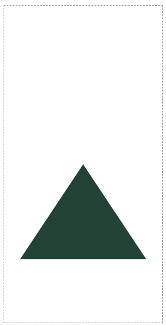
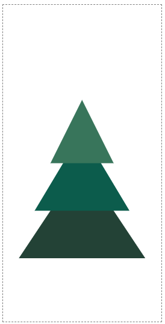
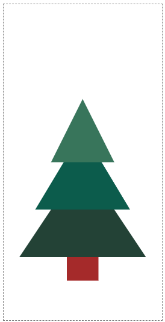

# 2. SVG로 크리스마스 트리 만들기

## `polygon` 요소 사용

이미지를 조합하기 위해 항상 기본 모양을 사용할 수 없다. `polygon`은 자유형 모양을 그리는 방법이다. `points` 속성은 직선으로 연결된 좌표의 목록을 설정한다.

---

3개의 삼각형으로 이루어진 트리를 만들 수 있다. 아래에 위치한 것 부터 레이어를 쌓아 올려가며 그린다.



```html
<svg width="200" height="400" viewBox="-100 -200 200 400">
  <polygon points="0,0 80,120 -80,120" fill="#234236" />
</svg>
```


```html
<svg width="200" height="400" viewBox="-100 -200 200 400">
  <polygon points="0,0 80,120 -80,120" fill="#234236" />
  <polygon points="0,-40 60,60 -60,60" fill="#0C5C4C" />
</svg>
```



```html
<svg width="200" height="400" viewBox="-100 -200 200 400">
  <polygon points="0,0 80,120 -80,120" fill="#234236" />
  <polygon points="0,-40 60,60 -60,60" fill="#0C5C4C" />
  <polygon points="0,-80 40,0 -40,0" fill="#38755B" />
</svg>
```

마지막으로, 직사각형으로 나무 줄기를 그린다.



```html
<svg width="200" height="400" viewBox="-100 -200 200 400">
  <polygon points="0,0 80,120 -80,120" fill="#234236" />
  <polygon points="0,-40 60,60 -60,60" fill="#0C5C4C" />
  <polygon points="0,-80 40,0 -40,0" fill="#38755B" />
  <rect x="-20" y="120" width="40" height="30" fill="brown" />
</svg>
```
