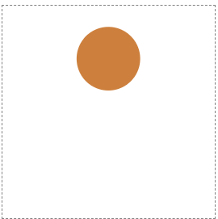
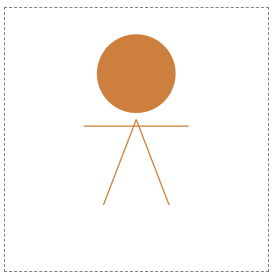
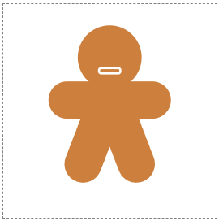

# 3. SVG로 진저브레드 그림 만들기

## 스타일 속성을 CSS로 이동

SVG가 HTML 파일 내에 있으므로 각 요소에 CSS 클래스를 할당하고 일부 속성을 CSS로 이동할 수 있다.

단, 프레젠테이션 속성만 이동할 수 있으며 모양과 위치 속성은 HTML에 유지되어야 한다. 또한 색상, 획 및 글꼴 속성 등은 CSS로 이동할 수 있다.



```html
<svg width="200" height="200" viewBox="-100 -100 200 200">
  <circle class="head" cx="0" cy="-50" r="30" />
</svg>
```

```css
.head {
  fill: #cd803d;
}
```

## Rounded Lines

`line`의 `stroke` 속성으로 색을 설정할 수 있고, `stroke-linecap` 속성을 이용해 선의 모양을 조절할 수 있다.

비교를 위해 라인캡과 획 너비를 다르게 하면 다음과 같다.

```html
<svg width="200" height="200" viewBox="-100 -100 200 200">
  <circle class="head" cx="0" cy="-50" r="30" />

  <line class="limb" x1="-40" y1="-10" x2="40" y2="-10" />
  <line class="limb" x1="-25" y1="50" x2="0" y2="-15" />
  <line class="limb" x1="25" y1="50" x2="0" y2="-15" />
</svg>
```



```css
.limb {
  stroke: #cd803d;
}
```


```css
.limb {
  stroke: #cd803d;
  stroke-width: 35px;
  stroke-linecap: round;
}
```

## Rounded Rectangles

사각형에 `rx` 속성을 사용하면 가장자리를 둥글게 만들 수 있다. 일반 html 요소의 속성에서의 `border-radius`와 유사하다.



```html
<svg width="200" height="200" viewBox="-100 -100 200 200">
  <circle class="head" cx="0" cy="-50" r="30" />
  <rect class="mouth" x="-10" y="-40" width="20" height="5" rx="2" />

  <line class="limb" x1="-40" y1="-10" x2="40" y2="-10" />
  <line class="limb" x1="-25" y1="50" x2="0" y2="-15" />
  <line class="limb" x1="25" y1="50" x2="0" y2="-15" />
</svg>
```

```css
.mouth {
  fill: none;
  stroke: white;
  stroke-width: 2px;
}
```

## 눈과 버튼 추가

눈과 버튼을 추가하면 진저브레드가 만들어진다. 최종 코드는 다음과 같다.

```html
<svg width="200" height="200" viewBox="-100 -100 200 200" class="gingerbread">
  <circle class="head" cx="0" cy="-50" r="30" />

  <circle class="eye" cx="-12" cy="-55" r="3" />
  <circle class="eye" cx="12" cy="-55" r="3" />
  <rect class="mouth" x="-10" y="-40" width="20" height="5" rx="2" />

  <line class="limb" x1="-40" y1="-10" x2="40" y2="-10" />
  <line class="limb" x1="-25" y1="50" x2="0" y2="-15" />
  <line class="limb" x1="25" y1="50" x2="0" y2="-15" />

  <circle class="button" cx="0" cy="-10" r="5" />
  <circle class="button" cx="0" cy="10" r="5" />
</svg>
```

```css
.head {
  fill: #cd803d;
}

.eye {
  fill: white;
}

.mouth {
  fill: none;
  stroke: white;
  stroke-width: 2px;
}

.limb {
  stroke: #cd803d;
  stroke-width: 35px;
  stroke-linecap: round;
}
```
