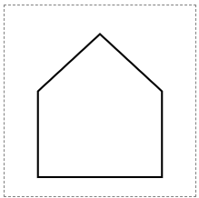
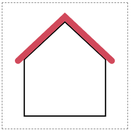

# 4. SVG로 집 짓기

원, 직사각형, 선, 다각형을 사용해 집을 만들어 보자.

1. 집의 벽을 그린다.



```html
<svg class="house" width="200" height="200" viewBox="-100 -100 200 200">
  <polygon class="wall" points="-65,80 -65,-10 0,-70 65,-10 65,80" />
</svg>
```

```css
.house {
  stroke: black;
  stroke-width: 2px;
  fill: white;
}
```

2. 지붕을 추가한다.

`polyline`을 사용해 지붕을 그린다. `polygon`은 항상 스스로 닫히고, `polyline`은 열린 상태로 유지된다.

`stroke-linecap`으로 지붕의 형태를 추가한다.



```html
<svg class="house" width="200" height="200" viewBox="-100 -100 200 200">
  <polygon class="wall" points="-65,80 -65,-10 0,-70 65,-10 65,80" />
  <polyline class="roof" points="-75,-8 0,-78 75,-8" />
</svg>
```

```css
.roof {
  fill: none;
  stroke: #d1495b;
  stroke-width: 10px;
  stroke-linecap: round;
}
```

3. 문, 창문, 계단을 추가해 완성한다.


```html
<svg class="house" width="200" height="200" viewBox="-100 -100 200 200">
  <polygon class="wall" points="-65,80 -65,-10 0,-70 65,-10 65,80" />
  <polyline class="roof" points="-75,-8 0,-78 75,-8" />

  <rect class="door" x="-45" y="10" width="30" height="60" rx="2" />
  <circle class="door-knob" cx="-35" cy="40" r="2" />
  <rect class="stair" x="-47" y="70" width="34" height="5" />
  <rect class="stair" x="-49" y="75" width="38" height="5" />

  <rect class="window" x="5" y="15" width="40" height="35" rx="5" />
  <line x1="5" y1="32.5" x2="45" y2="32.5" />
  <line x1="25" y1="15" x2="25" y2="50" />
  <rect class="window-sill" x="2" y="48" width="46" height="5" rx="5" />

  <circle class="window" cx="0" cy="-25" r="15" />
  <line x1="-15" y1="-25" x2="15" y2="-25" />
  <line x1="0" y1="-40" x2="0" y2="-10" />
</svg>
```

```css
.door {
  fill: #d1495b;
}
.stair {
  fill: gray;
}
.window {
  fill: #fdea96;
}
.window-sill {
  fill: #d1495b;
  stroke-linecap: round;
}
```
