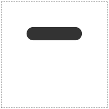
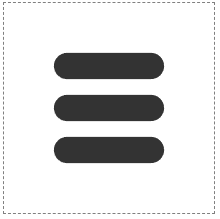
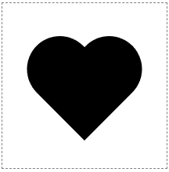
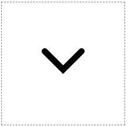
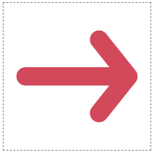

# 6. SVG로 기본 경로를 그리는 방법

`path`는 SVG 요소 중 하나로, path를 사용해 거의 모든것을 만들 수 있다.

경로의 모양은 `d` 속성에 의해 정의된다. 이 속성은 여러 그리기 명령을 정의한다.

명령은 항상 명령 유형을 정의하는 문자로 시작해서 좌표로 끝난다.

가장 기본적인 명령은 move-to, line-to 두 가지이다.

move-to 명령은 선을 그리지 않고 커서를 점으로 이동시키고, line-to 명령은 이전 점에서 직선을 그린다. 명령은 항상 이전 명령에서 계속된다.

즉, 선을 그릴 때 끝 점만 정의하며 시작 점은 이전 명령의 끝 점이 된다.

---

## 햄버거 메뉴 아이콘

move-to(`M`) 및 line-to(`L`)를 사용해 동일한 경로 내에 세 개의 선을 그린다.

1. 맨 윗줄의 시작점(`M -40, -40`)으로 이동하여 끝 줄(`L 40, -40`)까지 선을 그린다.



```html
<svg width="200" height="200" viewBox="-100 -100 200 200">
  <path
    d="
        M -40, -40
        L  40, -40"
    stroke="#333333"
    stroke-width="25"
    stroke-linecap="round"
  />
</svg>
```

2. 계속해서 같은 방식으로 아래에 선을 그린다. 경로는 연속적일 필요가 없고, 동일한 경로 내에서 여러 이동 명령을 가질 수 있다.

X와 Y좌표 사이의 쉼표는 선택사항이며, 생략 가능하다.



```html
<svg width="200" height="200" viewBox="-100 -100 200 200" class="border">
  <path
    d="
          M -40 -40
          L  40 -40
          M -40 0
          L 40 0
          M -40 40
          L 40 40
          "
    stroke="#333333"
    stroke-width="25"
    stroke-linecap="round"
  />
</svg>
```

---

## V 아이콘

move to 명령 한 줄과 line to 명령 두 줄로 만든 예시 아이콘이다.



```html
<svg width="200" height="200" viewBox="-100 -100 200 200" class="border">
  <path
    d="M -30 -20 L 0 10 L 30 -20"
    fill="none"
    stroke="black"
    stroke-width="80"
    stroke-linecap="round"
  />
</svg>
```

위의 예시에서 `stroke-width` 속성 값을 줄이면 단순한 `V` 모양이라는 것을 알 수 있다.



```html
<svg width="200" height="200" viewBox="-100 -100 200 200">
  <path
    d="M -30 -20 L 0 10 L 30 -20"
    fill="none"
    stroke="black"
    stroke-width="10"
    stroke-linecap="round"
  />
</svg>
```

---

## 화살표 아이콘

1. 중앙의 선으로 시작한 다음 선을 계속 이어 위쪽 날개를 그린다.


```html
<svg width="200" height="200" viewBox="-100 -100 200 200">
  <path
    d="M -70 0 L 70 0 L 30 -50"
    fill="none"
    stroke="#D1495B"
    stroke-width="25"
    stroke-linecap="round"
    stroke-linejoin="round"
  />
</svg>
```

여기서 `stroke-linejoin`은 경로 모서리의 모양을 정의한다. `stroke-linecap`은 줄의 끝에만 영향을 미친다.

`stroke-linejoin`이 없으면 다음과 같다.


```html
<svg width="200" height="200" viewBox="-100 -100 200 200">
  <path
    d="M -70 0 L 70 0 L 30 -50"
    fill="none"
    stroke="#D1495B"
    stroke-width="25"
    stroke-linecap="round"
  />
</svg>
```

2. 다시 수평선의 끝부분으로 이동하여 화살표 아래쪽 날개를 그린다.



```html
<svg width="200" height="200" viewBox="-100 -100 200 200" class="border">
  <path
    d="M -70 0 L 70 0 L 30 -50 M 70 0 L 30 50"
    fill="none"
    stroke="#D1495B"
    stroke-width="25"
    stroke-linecap="round"
    stroke-linejoin="round"
  />
</svg>
```
