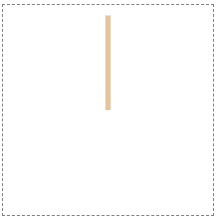

# 7. SVG로 이미지 요소를 재사용하는 방법

## SVG로 눈송이 그리기

- 동일한 코드를 반복하는 대신 모양에 대한 정의를 만들어 재사용할 수 있다.

- 눈송이의 가지를 정의한 다음, 이를 다른 회전으로 6번 사용한다.

- path와 move to(M), line to(L) 명령을 사용해 간단한 선(주 분기)을 그릴 수 있다.



```html
<svg width="200" height="200" viewBox="-100 -100 200 200">
  <path d="M 0 0 L 0 -90" stroke="#E5C39C" stroke-width="5" />
</svg>
```

- 그 다음 계속해서 측면 분기를 추가할 수 있다. 완성된 분기는 다음과 같다.


```html
<svg width="200" height="200" viewBox="-100 -100 200 200">
  <path
    id="branch"
    d="
        M 0   0 L   0 -90
        M 0 -20 L  20 -34
        M 0 -20 L -20 -34
        M 0 -40 L  20 -54
        M 0 -40 L -20 -54
        M 0 -60 L  20 -74
        M 0 -60 L -20 -74"
    stroke="#E5C39C"
    stroke-width="5"
  />
</svg>
```

## 이미지 요소 재사용

- 전체 분기 경로를 `defs` 섹션으로 이동한다. 섹션은 `defs` 이미지의 숨겨진 구획이다. 이 내용은 화면에 표시되지 않지만, 나중에 참조하고 사용할 수 있다.

- 브랜치를 정의한 후에는 `use` 명령을 사용하여 이를 다음과 같이 재사용할 수 있다.

- `transform` 명령을 사용해 개별 분기를 올바른 위치로 이동한다.


```html
<svg width="200" height="200" viewBox="-100 -100 200 200">
  <defs>
    <path
      id="branch"
      d="
        M 0 0 L 0 -90
        M 0 -20 L 20 -34
        M 0 -20 L -20 -34
        M 0 -40 L 20 -54
        M 0 -40 L -20 -54
        M 0 -60 L 20 -74
        M 0 -60 L -20 -74"
      stroke="#E5C39C"
      stroke-width="5"
    />
  </defs>

  <use href="#branch" />
  <use href="#branch" transform="rotate(60)" />
  <use href="#branch" transform="rotate(120)" />
  <use href="#branch" transform="rotate(180)" />
  <use href="#branch" transform="rotate(240)" />
  <use href="#branch" transform="rotate(300)" />
</svg>
```
