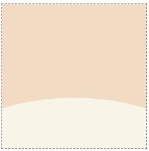
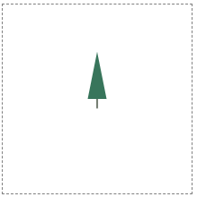

# 8. SVG로 숲 그리기

- 나무 모양을 정의한 다음 다양한 위치에 다양한 크기로 배치하여 숲을 그릴 수 있다.

## 배경 만들기

- 직사각형과 원을 이용해 배경을 만든다.



```html
<svg width="200" height="200" viewBox="-100 -100 200 200">
  <rect x="-100" y="-100" width="200" height="200" fill="#F1DBC3" />
  <circle cx="0" cy="380" r="350" fill="#F8F4E8" />
</svg>
```

## 나무 만들기

- 간단한 다각형과 선으로 나무 모양을 정의한다.



```html
<svg width="200" height="200" viewBox="-100 -100 200 200">
  <polygon points="-10,0 10,0 0 -50" fill="#38755b" />
  <line x1="0" y1="0" x2="0" y2="10" stroke="#778074" stroke-width="2" />
</svg>
```

- 눈송이 예제에서 했던 것과 유사한 방식으로 이를 재사용할 수 있다.

- 이 모양을 `defs`로 래핑하고 id를 설정한 다음 use를 사용해 재사용한다.

- `x, y` 좌표를 설정하여 요소를 배치하고, `scale`으로 크기를 조절한다.

```html
<svg width="200" height="200" viewBox="-100 -100 200 200">
  <defs>
    <g id="tree">
      <polygon points="-10,0 10,0 0 -50" fill="#38755b" />
      <line x1="0" y1="0" x2="0" y2="10" stroke="#778074" stroke-width="2" />
    </g>
  </defs>

  <use href="#tree" x="-30" y="25" transform="scale(2)" />
  <use href="#tree" x="-20" y="40" transform="scale(1.2)" />
  <use href="#tree" x="40" y="40" />
  <use href="#tree" x="50" y="30" transform="scale(1.5)" />
</svg>
```

## 완성

- 완성된 svg 코드는 다음과 같다.


```html
<svg width="200" height="200" viewBox="-100 -100 200 200">
  <defs>
    <g id="tree">
      <polygon points="-10,0 10,0 0,-50" fill="#38755b" />
      <line x1="0" y1="0" x2="0" y2="10" stroke="#778074" stroke-width="2" />
    </g>
  </defs>

  <rect x="-100" y="-100" width="200" height="200" fill="#F1DBC3" />
  <circle cx="0" cy="380" r="350" fill="#F8F4E8" />

  <use href="#tree" x="-30" y="25" transform="scale(2)" />
  <use href="#tree" x="-20" y="40" transform="scale(1.2)" />
  <use href="#tree" x="40" y="40" />
  <use href="#tree" x="50" y="30" transform="scale(1.5)" />
</svg>
```
