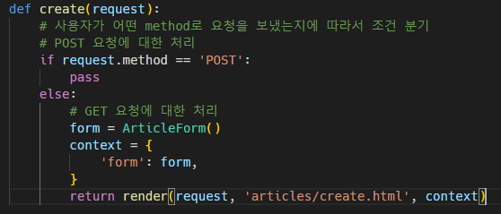
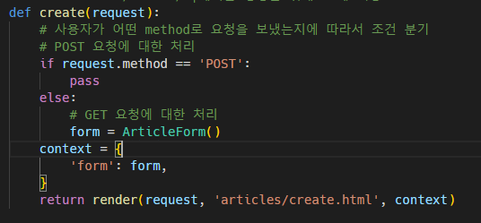
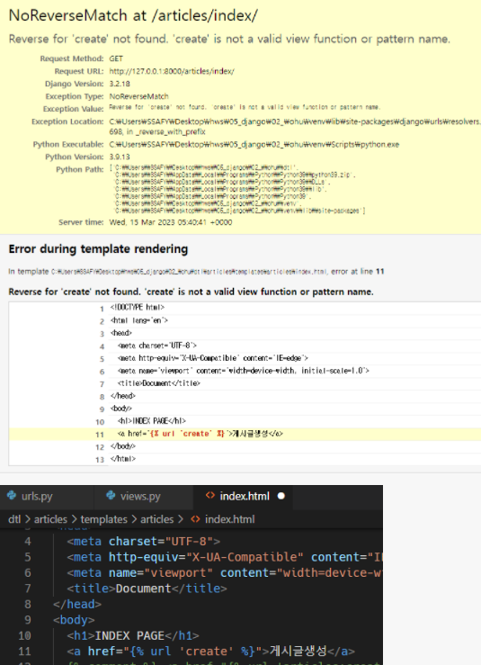

### Page not found

- 없는 경로로 요청이 들어왔을 때

---

### TemplateDoesNotExist

- render 인자 경로에 `애플리캐이션이름/`을 안 넣음
- 주석처리된 `return`이 정답

---

### ValueError

- POST 요청에서 pass라서 none을 반환

---

### UnboundLocalError

- `form` 변수가 정의되지 않음

---

### NoReverseMatch

- url 태그에 app_name 지정 확인:

- urls.py에 app_name을 지정한 경우 url 태그: ``

---

### 
