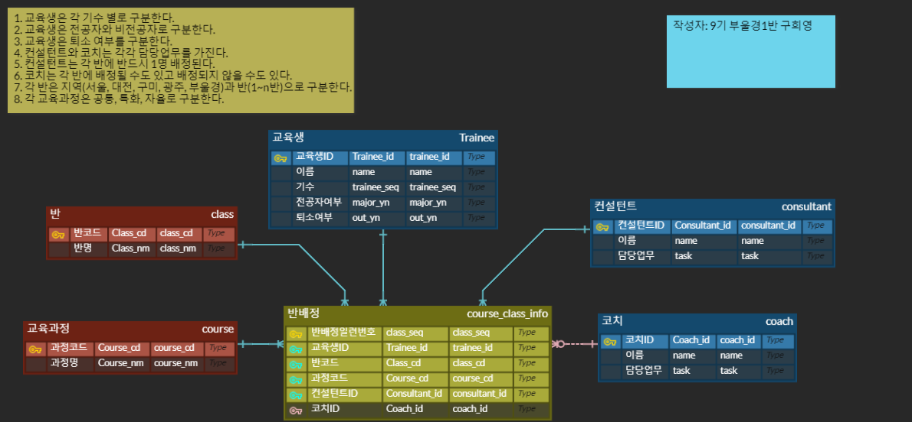

# 개요

- 내용을 Entity Relationship Diagram의 약자로 개체 관계라고도 부름

- 요구사항을 만족하는 형태의 DB를 다이어그램으로 그려내어 그 관계를 도출하는 것

- 데이터 구조를 저장하기 위한 기법 중 하나

- DBA 직군이 아니더라도 개발자는 간단한 모델링은 직접 가능해야 함

## 사전 학습

- 관계형 데이터베이스 설계 개념 이해

- ERD 개념 및 구성요소(엔티티, 속성, 관계)에 관한 이해

# 요구사항 분석

- 주어진 요구사항을 분석해서 **엔티티**와 *속성*을 도출

> ### 요구사항

  1. **교육생**은 각 *기수* 별로 구분한다.

  2. **교육생**은 *전공자*와 *비전공자*로 구분한다.

  3. **교육생**은 *퇴소 여부*를 구분한다.

  4. **컨설턴트**와 **코치**는 각각 *담당업무*를 가진다.

  5. **컨설턴트**는 각 **반**에 __반드시 1명__ 배정된다.

  6. **코치**는 각 **반**에 __배정될 수도 있고 배정되지 않을 수도__ 있다.

  7. 각 **반**은 지역(서울, 대전, 구미, 광주, 부울경)과 반(1~n반)으로 구분한다.

  8. 각 **교육과정**은 과정(공통, 특화, 자율) 별로 구분한다.

# ERD 작성

## 엔티티를 추출하여 ERD에 작성

  - 교육생, 컨설턴트, 코치, 반, 교육과정, 반배정

## 속성을 추출하여 ERD에 컬럼에 작성

  - 이름, 전공여부, 등록일, 수정일, 기수, 퇴소여부, 반명, 과정명, 담당업무내용 등

## PK값 설정 및 엔티티간 관계선 연결

  - 배정될 수도 있고 배정되지 않을 수도 있는 조건

