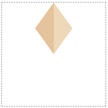

# 9. transform 속성 사용하기

## 별 그리기

- 별은 단순한 모양이다.

- 별을 다각형 묶음으로 정의하고 각 점을 개별적으로 설정할 수 있다.

- 별의 꼭짓점의 각 좌표를 알면, 한 방향을 정의한 다음 회전을 통해 5번 반복해 동일한 모양을 얻을 수 있다.

- 회전은 `transform` 속성을 이용해서 설정한다.

---

- 여기서 한 꼭짓점은 두 개의 다각형으로 구성된다.



```html
<svg width="200" height="200" viewBox="-100 -100 200 200">
  <polygon points="0,0 36,-50 0,-100" fill="#EDD8B7" />
  <polygon points="0,0 -36,-50 0,-100" fill="#E5C39C" />
</svg>
```

- `g`로 그룹화하고 회전할 수 있다.

- 여기서 `g` 요소는 html의 `div`요소와 비슷한 역할을 한다. `g` 요소에는 다른 요소가 포함될 수 있으며, 그룹 요소에 정의된 속성은 해당 하위 요소에 적용된다.

- `rotate`로 각각의 꼭짓점을 올바른 위치에 놓는다.


```html
<svg width="200" height="200" viewBox="-100 -100 200 200">
  <g transform="translate(0 5)">
    <g>
      <polygon points="0,0 36,-50 0,-100" fill="#EDD8B7" />
      <polygon points="0,0 -36,-50 0,-100" fill="#E5C39C" />
    </g>
    <g transform="rotate(72)">
      <polygon points="0,0 36,-50 0,-100" fill="#EDD8B7" />
      <polygon points="0,0 -36,-50 0,-100" fill="#E5C39C" />
    </g>
    <g transform="rotate(-72)">
      <polygon points="0,0 36,-50 0,-100" fill="#EDD8B7" />
      <polygon points="0,0 -36,-50 0,-100" fill="#E5C39C" />
    </g>
    <g transform="rotate(144)">
      <polygon points="0,0 36,-50 0,-100" fill="#EDD8B7" />
      <polygon points="0,0 -36,-50 0,-100" fill="#E5C39C" />
    </g>
    <g transform="rotate(-144)">
      <polygon points="0,0 36,-50 0,-100" fill="#EDD8B7" />
      <polygon points="0,0 -36,-50 0,-100" fill="#E5C39C" />
    </g>
  </g>
</svg>
```

- 좌표계의 원점(이미지의 중심)에서 시작하도록 다각형이 정의되었고, 회전은 기본적으로 좌표계 원점을 중심으로 이루어진다.

- 이미지를 중앙에 배치하기 위해 전체 별을 그룹화하고, `transform`을 사용해 Y좌표를 아래로 이동시킨다.

- `use`를 활용하여 코드를 단순화할 수 있다.

```html
<svg width="200" height="200" viewBox="-100 -100 200 200">
  <defs>
    <g id="star">
      <polygon points="0,0 36,-50 0,-100" fill="#EDD8B7" />
      <polygon points="0,0 -36,-50 0,-100" fill="#E5C39C" />
    </g>
  </defs>

  <g transform="translate(0 5)">
    <use href="#star" />
    <use href="#star" transform="rotate(72)" />
    <use href="#star" transform="rotate(-72)" />
    <use href="#star" transform="rotate(144)" />
    <use href="#star" transform="rotate(-144)" />
  </g>
</svg>
```
