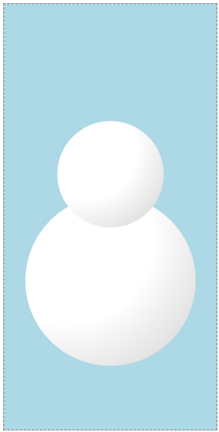

# 10. Gradient

- 그라데이션으로 채우기와 3D 효과를 줄 수 있다.

## 크리스마스 장식 업그레이드

- 1일차에 만든 크리스마스 장식품을 업그레이드 하자.

- 기본 원을 그라데이션으로 채우민 미묘한 3D 효과를 추가할 수 있다.

- `defs`섹션에서 `radialGradient`를 정의한다. CSS와는 다른 구문이지만 비슷한 기능을 한다.

- id를 정의하고, 색을 표현한다. `fill` 속성에 id값으로 사용할 수 있다.


```html
<svg
  style="border: dashed grey 1px"
  width="200"
  height="200"
  viewBox="-100 -100 200 200"
>
  <defs>
    <radialGradient id="shine" cx="0.25" cy="0.25" r="0.35">
      <stop offset="0%" stop-color="#e3a8b0" />
      <stop offset="100%" stop-color="#D1495B" />
    </radialGradient>
  </defs>

  <circle cx="0" cy="20" r="70" fill="url(#shine)" />
  <rect x="-17.5" y="-65" width="35" height="20" fill="#F79257" />
  <circle
    cx="0"
    cy="-75"
    r="12"
    fill="none"
    stroke="#F79257"
    stroke-width="2"
  />
</svg>
```

## 눈사람 만들기

- 원을 그라데이션으로 채운다.


```html
<svg
  width="200"
  height="200"
  viewBox="-100 -100 200 200"
  style="background-color: lightblue"
>
  <defs>
    <radialGradient id="snowball" cx="0.25" cy="0.25" r="1">
      <stop offset="0%" stop-color="white" />
      <stop offset="50%" stop-color="white" />
      <stop offset="100%" stop-color="#d6d6d6" />
    </radialGradient>
  </defs>

  <circle cx="0" cy="0" r="80" fill="url(#snowball)" />
</svg>
```

- 같은 원을 2개 그려 얼굴과 몸통을 완성한다.



```html
<svg
  width="200"
  height="400"
  viewBox="-100 -100 200 200"
  style="background-color: lightblue"
>
  <defs>
    <radialGradient id="snowball" cx="0.25" cy="0.25" r="1">
      <stop offset="0%" stop-color="white" />
      <stop offset="50%" stop-color="white" />
      <stop offset="100%" stop-color="#d6d6d6" />
    </radialGradient>
  </defs>

  <circle cx="0" cy="60" r="80" fill="url(#snowball)" />
  <circle cx="0" cy="-40" r="50" fill="url(#snowball)" />
</svg>
```

- 얼굴에 다각형 코를 추가하고 원 두개로 눈, 선으로 팔을 추가한다.


```html
<svg
  width="200"
  height="400"
  viewBox="-100 -100 200 200"
  style="background-color: lightblue"
>
  <defs>
    <radialGradient id="snowball" cx="0.25" cy="0.25" r="1">
      <stop offset="0%" stop-color="white" />
      <stop offset="50%" stop-color="white" />
      <stop offset="100%" stop-color="#d6d6d6" />
    </radialGradient>
  </defs>

  <circle cx="0" cy="60" r="80" fill="url(#snowball)" />
  <circle cx="0" cy="-40" r="50" fill="url(#snowball)" />
  <!-- 코 -->
  <polygon points="10,-46 50,-40 10,-34" fill="#e66465" />
  <!-- 눈 -->
  <circle cx="0" cy="-55" r="5" />
  <circle cx="20" cy="-55" r="5" />
  <!-- 팔 -->
  <line x1="-40" y1="30" x2="-90" y2="-30" stroke="black" stroke-width="5" />
  <line x1="-65" y1="0" x2="-90" y2="-10" stroke="black" stroke-width="5" />
</svg>
```
