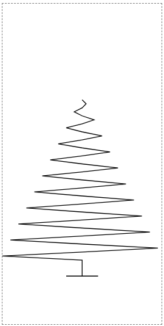

# 11. 2차 베지에 곡선 그리기

- 2차 베지에 곡선으로 다양한 경로를 그릴 수 있다.

- 끝 점을 설정하는 것 뿐만 아니라 제어점도 설정해야 한다.

  - 제어점은 선이 구부러지기는 하지만, 닿지 않는 보이지 않는 좌표

### 표정

```html
<svg width="200" height="200" viewBox="-100 -100 200 200">
  <circle cx="-50" cy="-50" r="20" />
  <circle cx="50" cy="-50" r="20" />
  <path
    d="
      M -70,50 
      Q 0,100 70,50"
    fill="none"
    stroke="black"
    stroke-width="10"
    stroke-linecap="round"
  />
</svg>
```


- 여기서 제어점은 이미지 하단 중앙(0, 100)에 위치한다.

- 제어점이 반드시 두 끝점의 동일한 거리에 있을 필요는 없다.

[SVG Curves](https://hunormarton.github.io/svg-curves/quadratic)에서 예시를 볼 수 있다.

### 트리

- 경로가 아래로 내려갈수록 제어점이 트리 중심에서 점점 멀어지게 표현하면 다음과 같다.


```html
<svg width="200" height="400" viewBox="-100 -200 200 400">
  <path
    d="
      M 0 -80
      Q 5 -75 0 -70
      Q -10 -65 0 -60
      Q 15 -55 0 -50
      Q -20 -45 0 -40
      Q 25 -35 0 -30
      Q -30 -25 0 -20
      Q 35 -15 0 -10
      Q -40 -5 0 0
      Q 45 5 0 10
      Q -50 15 0 20
      Q 55 25 0 30
      Q -60 35 0 40
      Q 65 45 0 50
      Q -70 55 0 60
      Q 75 65 0 70
      Q -80 75 0 80
      Q 85 85 0 90
      Q -90 95 0 100
      Q 95 105 0 110
      Q -100 115 0 120
      L 0 140
      L 20 140
      L -20 140"
    fill="none"
    stroke="#0C5C4C"
    stroke-width="5"
  />
</svg>
```

- 2차 베지에를 두 개의 선분으로 나누면 다음과 같다.



```html
<svg width="200" height="400" viewBox="-100 -200 200 400">
  <path
    d="
      M 0 -80
      L 5 -75 L 0 -70
      L -10 -65 L 0 -60
      L 15 -55 L 0 -50
      L -20 -45 L 0 -40
      L 25 -35 L 0 -30
      L -30 -25 L 0 -20
      L 35 -15 L 0 -10
      L -40 -5 L 0 0
      L 45 5 L 0 10
      L -50 15 L 0 20
      L 55 25 L 0 30
      L -60 35 L 0 40
      L 65 45 L 0 50
      L -70 55 L 0 60
      L 75 65 L 0 70
      L -80 75 L 0 80
      L 85 85 L 0 90
      L -90 95 L 0 100
      L 95 105 L 0 110
      L -100 115 L 0 120
      L 0 140
      L 20 140
      L -20 140"
    fill="none"
    stroke="black"
  />
</svg>
```
