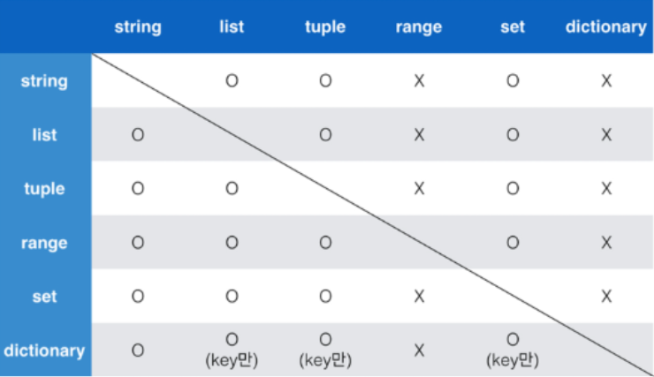

# 01_intro

# Python 01

## 변수(Variable)

- 데이터를 저장하기 위해서 사용
- 변수를 사용하면 복잡한 값들을 쉽게 사용할 수 있음(추상화)
  > 추상화(변수를 사용해야 하는 이유)
  - 코드의 가독성 증가
  - 숫자를 직접 적지 않고, 의미 단위로 작성 가능
  - 코드 수정이 용이해짐
- 동일 변수에 다른 데이터를 언제든 할당(저장)할 수 있기 때문에, '변수'라고 불림

### 변수의 할당

- 변수는 할당 연산자(=)를 통해 값을 할당(assignment)
- 같은 값을 동시에 할당할 수 있음
- 다른 값을 동시에 할당할 수 있음

## 식별자(Identifiers)

- 변수의 이름을 식별자라고 함(변수, 함수, 클래스, ...)
- 읽기 쉽고 이해하기 쉬운 변수명, 약속한 규칙
  > 변수이름 규칙
  - 식별자의 이름은 영문 알파벳, 언더스코어(\_), 숫자로 구성
  - 첫 글자에 숫자가 올 수 없음
  - 길이 제한이 없고, 대소문자를 구별
  - keyword 예약어(reserved words)로 사용할 수 없음
  - 내장함수나 모듈 등의 이름도 사용하지 않아야 함:
    동작을 예상할 수 없게 임의로 값을 할당하게 되므로 범용적이지 않은 코드가 됨

## 주석(comment)

- 코드의 실행에 영향을 미치지 않는 나만의 메모
- "주석 다는 습관":
  - 코드에 대한 쉬운 이해
  - 유지보수 용이
  - 협업 용이

## 연산자

### 산술 연산자(Arithmetic Operator)

- 기본적인 사칙연산 및 수식 계산
  | 연산자 | 내용     |
  | ------ | -------- |
  | +      | 덧셈     |
  | -      | 뺄셈     |
  | \*     | 곱셈     |
  | /      | 나눗셈   |
  | //     | 몫       |
  | \*\*   | 거듭제곱 |
  | %      | 나머지   |
  > 연산자 우선순위
  - 기본적으로 수학에서 우선순위와 같음
  - 괄호가 먼저 계산되고 그 다음에
  - 곱하기(\*)와 나누기(/)가 더하기(+)와 빼기(-)보다 먼저 계산됨

## 자료형(Data type)

### 자료형과 메모리

- 프로그래밍에서 변수는 메모리의 주소를 기억하는 이름이다
- 자료형마다 차지하는 메모리의 크기가 다르다
  `id()` >>> 메모리 주소

### 자료형 분류

- 수치형(Numeric Type)
  - int (integer, 정수)
  - float (floating point number, 부동소수점, 실수)
  - complex (complex number, 복소수)
- 문자열 (String Type)
- 불린형 (Boolean Type)
- None
- 그리고 이런 애들이 모여있는 자료형들 (list, tuple, range, dict, set, ...)

## 수치형(Numeric Type)

### 정수 자료형(int)

- 0, 100, -200과 같은 정수를 표현하는 자료형
  - 일반적인 수학 연산(사칙연산) 가능

### 실수 자료형(float)

- 유리수와 무리수를 포함하는 '실수'를 다루는 자료형
  > 실수 연산시 주의할 점(부동소수점)
  - 실수의 값을 처리할 때 의도하지 않은 값이 나올 수 있음, 원인은 부동소수점
    - 컴퓨터는 2진수를 사용, 사람은 10진법을 사용
    - 이때 10진수 0.1은 2진수로 표현하면 0.00011001100110011.... 같이 무한대로 반복
    - 무한대 숫자를 그대로 저장할 수 없어서 사람이 사용하는 10진법의 근사값만 표시
    - 0.1의 경우 0.1에 가깝지만 정확히 동일하지 않음
    - 이런 과정에서 예상치 못한 결과가 나타남
    - 이런 증상을 Floating point rounding error
  - 해결책
    - 값을 비교하는 과정에서 정수가 아닌 실수면 주의할 것
    - 매우 작은 수보다 작은지를 확인하거나 math모듈 활용

### 진수 표현

- 여러 진수 표현 가능
  - 2진수(binary): 0b
  - 8진수(octal): 0o
  - 16진수(hexadecimal): 0x

## 문자열 자료형(String Type)

- 모든 문자는 str타입
- 문자열은 작은 따옴표(')나 큰 따옴표(")를 활용하여 표기
  - 문자열을 묶을 때 동일한 문장 부호를 활용
  - PEP8에서는 소스코드 내에서 하나의 문장부호를 선택하여 유지하도록 함
- **중첩따옴표**
  - 따옴표 안에 따옴표를 표현할 경우
  - 작은따옴표가 들어있는 경우는 큰따옴표로 문자열 생성
  - 큰따옴표가 들어있는 경우는 작은따옴표로 문자열 생성
- **삼중 따옴표(Triple Quotes)**
  - 작은따옴표나 큰따옴표를 삼중으로 사용
  - 따옴표 안에 따옴표를 넣을 때, 여러 줄을 나눠 입력할 때 편리

### Excape sequence

- 역슬래시(backslash)뒤에 특정 문자가 와서 특수한 기능을 하는 문자 조합 (제어 시퀀스)
  | 예약문자 | 내용(의미)                         |
  | -------- | ---------------------------------- |
  | \n       | 줄 바꿈                            |
  | \t       | 탭                                 |
  | \r       | 캐리지 리턴(커서를 줄의 맨 앞으로) |
  | \o       | 널(Null)                           |
  | \        | \                                  |
  | '        | 단일인용부호(')                    |
  | "        | 이중인용부호(")                    |

### String Interpolation(문자열을 변수를 활용하여 만드는 법)

- **f-strings**: python 3.6+

## None

- 파이썬 자료형 중 하나
- 값이 없음을 표현하기 위해 None 타입이 존재
- 일반적으로 반환값이 없는 함수에서 사용하기도 함

## 불린형(Boolean)

- 논리 자료형으로 참과 거짓을 표현하는 자료형
- True 또는 False를 값으로 가짐
- 비교 / 논리 연산에서 활용됨

### 비교 연산자

- 수학에서 등호와 부등호와 동일한 개념
- 주로 조건문에 사용되며 값을 비교할 때 사용
- 결과는 True/False값을 반환함
  | 연산자 | 내용                                       |
  | ------ | ------------------------------------------ |
  | <      | 미만                                       |
  | <=     | 이해                                       |
  | >      | 초과                                       |
  | >=     | 이상                                       |
  | ==     | 같음                                       |
  | !=     | 같지않음                                   |
  | is     | 객체 아이덴티티(OOP), 메모리 공간까지 동일 |
  | is not | 객체 아이덴티티가 아닌 경우                |

### 논리 연산자

- 여러가지 조건이 있을 때
- 모든 조건을 만족하거나(And), 여러 조건 중 하나만 만족해도 될 때(or)
  특정 코드를 실행하고 싶을 때 사용
- 일반적으로 비교연산자와 함께 사용됨

| 연산자  | 내용                           |
| ------- | ------------------------------ |
| A and B | A와 B 모두 True시, True        |
| A or B  | A와 B 모두 False시, False      |
| Not     | True를 False로, False를 True로 |

### 논리연산자 주의할 점/ not 연산자

- Falsy: False는 아니지만 False로 취급되는 다양한 값
  - 0, 0.0, (), [], {}, None, ""(빈 문자열)
- 논리 연산자도 우선순위가 존재
  - not, and, or 순으로 우선순위가 높음
  - 괄호사용

### 논리 연산자의 단축평가

- 결과가 확실한 경우 두번째 값은 확인하지 않고 첫번째 값 반환
- and 연산에서 첫번째 값이 False인 경우 무조건 False => 첫번째 값 반환
- or 연산에서 첫번째 값이 True인 경우 무조건 True => 첫번째 값 반환
- 0은 False, 1은 True

## 컨테이너

- 여러개의 값(데이터)을 담을 수 있는 것(객체)으로, 서로 다른 자료형을 저장할 수 있음
- 컨테이너의 분류:
  - 순서가 있는 데이터(Ordered) vs 순서가 없는 데이터(Unordered)
  - 순서가 있다 != 정렬되어 있다

## 시퀀스형 컨테이너

### 리스트

- 여러 개의 값을 순서가 있는 구조로 저장하고 싶을 때 사용
- 리스트의 생성과 접근
  - 대괄호`[]` 혹은 `list()`(주로 형 변환할때 사용)를 통해 생성
    - 파이썬에는 어떠한 자료형도 저장할 수 있으며, 리스트 안에 리스트도 넣을 수 있음
    - 생성된 이후 내용 변경이 가능(가변자료형:**mutable**)
  - 순서가 있는 시퀀스로 인덱스를 통해 접근 가능
  - 값에 대한 접근은 `list[i]`

### 튜플

- 여러 개의 값을 순서가 있는 구조로 저장하고 싶을 때 사용
- 리스트와의 차이점은 생성 후 담고있는 값 변경이 불가(불변자료형:**immutable**)
- 항상 소괄호 형태로 사용
- 튜플의 생성과 접근
  - 소괄호`()` 혹은 `tuple()`을 통해 생성
  - 튜플은 수정 불가능한 시퀀스로 인덱스로 접근 가능
  - 값에 대한 접근은 `my_tuple[i]`
- 생성 시 주의사항
  - 단일 항목의 경우: 하나의 항목으로 구성된 튜플은 생성 시 값 뒤에 쉼표를 붙여야 함
  - 복수 항목의 경우: 마지막 항목에 붙은 쉼표는 없어도 되지만, 넣는 것을 권장(Trailing comma)

### Range

- 숫자의 시퀀스를 나타내기 위해 사용
- 주로 반복문과 함께 사용됨
- 기본 사용방법
  - 기본형: `range(n)`, 0부터 n-1까지의 숫자의 시퀀스
  - 범위 지정: `range(n,m)`, n부터 m-1까지의 숫자의 시퀀스

### 슬라이싱 연산자

- 시퀀스를 특정 단위로 슬라이싱
  - 인덱스와 콜론을 사용하여 문자열의 특정 부분만 잘라낼 수 있음
  - 슬라이싱을 이용하여 문자열을 나타낼 때 콜론을 기준으로 앞 인덱스에 해당하는 문자는 포함되지만 뒤 인덱스에 해당 문자는 미포함

## 비시퀀스형 컨테이너

### 딕셔너리

- 키-값(key-value) 쌍으로 이뤄진 자료형
  (3.7부터는 ordered, 이하 버전은 unordered)
- Dictionary의 키(key)
  - key는 변경 불가능한 데이터만 활용 가능
    - string, integer, float, boolean, tuple, range
- 각 키의 값(values)
  - 어떠한 형태든 관계없음
- 딕셔너리 생성
  - 중괄호`{}` 혹은 `dict()`을 통해 생성
  - key를 통해 value에 접근

### 형 변환(Typecasting)

- 데이터 형태는 서로 변환할 수 있음
- 암시적 형 변환(Implicit)
  - 사용자가 의도하지 않고, 파이썬 내부적으로 자료형을 변환하는 경우
  - bool, Numeric type(int, float)

```python
print(True + 3)     # 4
print(3 + 5.0)      # 8.0
```

- 명시적 형 변환(Explicit)
  - 사용자가 특정 함수를 활용하여 의도적으로 자료형을 변환하는 경우
  - str, float -> int (단, 형식에 맞는 문자열만 변환 가능)
    - float는 정수부만 변환
  - str(참고), int -> float (단, 형식에 맞는 문자열만 변환 가능)
  - int, float, list, tuple, dict -> str
- 컨테이너 형 변환
  
